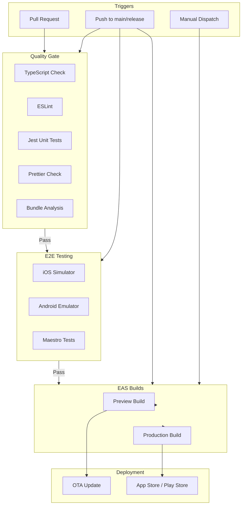
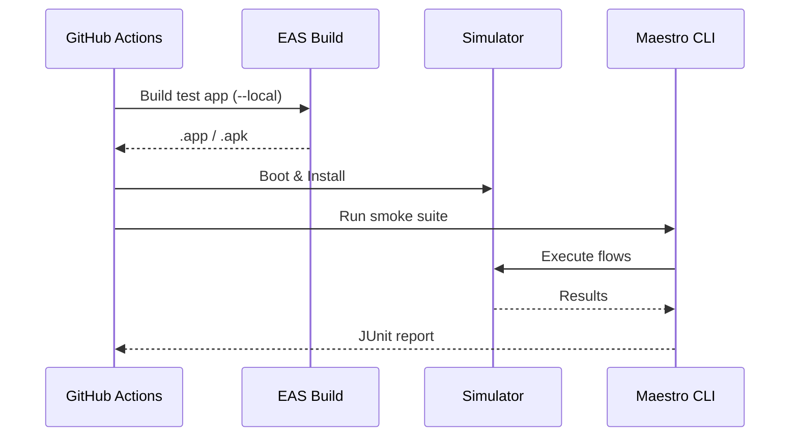
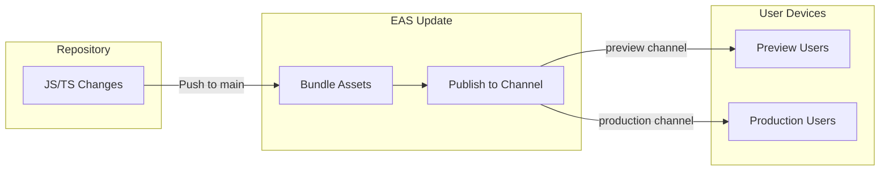

# CI/CD Pipeline

Our CI/CD pipeline automates quality checks, testing, building, and deployment using **GitHub Actions** and **Expo Application Services (EAS)**.

:::info Showcase Mode

This project is currently configured for **public showcase**. Some workflows are disabled to conserve resources:

| Workflow | Status | Reason |
|----------|--------|--------|
| `ci.yml` | ✅ Active | Quality checks are cheap (ubuntu runners) |
| `e2e.yml` | 🚫 Disabled | macOS runners are ~10x cost |
| `eas-build.yml` | 🚫 Disabled | Preserves EAS build quota |
| `eas-update.yml` | 🚫 Disabled | Preserves EAS update quota |
| `docs-pages.yml` | ⚠️ Partial | Build runs, deploy disabled |

To re-enable any workflow, search for `if: false # SHOWCASE MODE` in the workflow files and remove those lines.

:::

## Pipeline Overview



### Text Diagram (Non-Mermaid)

```
┌─────────────────────────────────────────────────────────────────────────┐
│                        GitHub Actions Pipeline                          │
├─────────────────────────────────────────────────────────────────────────┤
│                                                                         │
│  TRIGGERS                                                               │
│  ────────                                                               │
│  • Pull Request → Quality checks                                        │
│  • Push to main/release/* → Full pipeline                               │
│  • Manual dispatch → On-demand builds                                   │
│                                                                         │
│  ┌─────────────┐     ┌─────────────┐     ┌─────────────┐               │
│  │   ci.yml    │     │  e2e.yml    │     │docs-pages   │               │
│  │             │     │             │     │   .yml      │               │
│  │ • typecheck │     │ • iOS E2E   │     │             │               │
│  │ • lint      │     │ • Android   │     │ • Build     │               │
│  │ • test      │     │   E2E       │     │ • Deploy    │               │
│  │ • format    │     │             │     │             │               │
│  │ • bundle    │     │             │     │             │               │
│  └──────┬──────┘     └──────┬──────┘     └─────────────┘               │
│         │                   │                                           │
│         └─────────┬─────────┘                                           │
│                   ▼                                                     │
│         ┌─────────────────┐     ┌─────────────────┐                    │
│         │  eas-build.yml  │     │ eas-update.yml  │                    │
│         │                 │     │                 │                    │
│         │ • preview builds│     │ • OTA updates   │                    │
│         │ • prod builds   │     │ • JS-only       │                    │
│         └────────┬────────┘     └────────┬────────┘                    │
│                  │                       │                              │
│                  ▼                       ▼                              │
│         ┌─────────────────────────────────────────┐                    │
│         │              EAS Cloud                   │                    │
│         │                                          │                    │
│         │  Channels: development │ preview │ prod  │                    │
│         └─────────────────────────────────────────┘                    │
│                                                                         │
└─────────────────────────────────────────────────────────────────────────┘
```

## Workflows

### 1. Quality Checks (`ci.yml`)

Runs on every PR and push to ensure code quality.

| Check       | Tool           | Purpose            |
| ----------- | -------------- | ------------------ |
| TypeScript  | `tsc --noEmit` | Type safety        |
| Linting     | ESLint         | Code standards     |
| Unit Tests  | Jest           | Logic verification |
| Formatting  | Prettier       | Consistent style   |
| Bundle Size | `expo export`  | Track bundle bloat |

**Bundle Analysis**: On PRs, a comment is posted showing iOS and Android bundle sizes to catch size regressions early.

```yaml
# Trigger
on:
  pull_request:
  push:
    branches: [main, release/**]
```

### 2. E2E Tests (`e2e.yml`)

End-to-end testing using Maestro on real simulators/emulators.



**Platforms tested**:

- iOS: iPhone 15 Simulator on macOS runner
- Android: Pixel 5 (API 34) on Ubuntu runner with KVM

**Artifacts on failure**:

- JUnit XML reports
- Screenshots for debugging

### 3. EAS Builds (`eas-build.yml`)

Automated native builds via Expo Application Services.

| Profile       | Channel       | Distribution | Use Case                         |
| ------------- | ------------- | ------------ | -------------------------------- |
| `development` | `development` | Internal     | Dev client for local development |
| `preview`     | `preview`     | Internal     | TestFlight / Internal testing    |
| `production`  | `production`  | Store        | App Store / Play Store release   |
| `test`        | `test`        | Internal     | E2E testing (simulator builds)   |

**Triggers**:

- Push to `main` → Preview builds
- Push to `release/*` → Preview builds
- Manual dispatch → Any profile

### 4. OTA Updates (`eas-update.yml`)

JavaScript-only updates delivered instantly without app store review.



**Triggers**:

- Push to `main` with changes in: `app/`, `components/`, `lib/`, `assets/`
- Manual dispatch for any channel

**Update Flow**:

1. Code pushed to `main`
2. EAS bundles JS/assets
3. Published to `preview` channel
4. Users with preview builds receive update on next app launch

### 5. Documentation (`docs-pages.yml`)

Builds and deploys this documentation site.

- **Trigger**: Push to `main` or changes in `docs-site/`
- **Output**: Static site deployed to GitHub Pages

## EAS Configuration

Our `eas.json` defines build profiles and update channels:

```json
{
  "build": {
    "development": {
      "channel": "development",
      "developmentClient": true
    },
    "preview": {
      "channel": "preview",
      "distribution": "internal"
    },
    "production": {
      "channel": "production",
      "autoIncrement": true
    },
    "test": {
      "channel": "test",
      "ios": { "simulator": true },
      "android": { "buildType": "apk" }
    }
  }
}
```

## Required Secrets

Configure these in **GitHub → Settings → Secrets → Actions**:

| Secret            | Used By           | How to Obtain                                                              |
| ----------------- | ----------------- | -------------------------------------------------------------------------- |
| `EXPO_TOKEN`      | All EAS workflows | [expo.dev/settings/access-tokens](https://expo.dev/settings/access-tokens) |
| `PUBLIC_DOCS_PAT` | docs-pages.yml    | GitHub PAT with repo access                                                |

## Local Development

### Run Quality Checks Locally

```bash
npm run typecheck    # TypeScript
npm run lint         # ESLint
npm run test         # Jest (watch mode)
npm run format:check # Prettier
```

### Build Test App Locally

```bash
# Build for simulator (requires Xcode/Android SDK)
npm run build:test:local:ios
npm run build:test:local:android

# Or use EAS cloud
npm run build:test:ios
npm run build:test:android
```

### Run E2E Tests Locally

```bash
# Ensure simulator/emulator is running with app installed
npm run e2e         # Run smoke suite
npm run e2e:studio  # Interactive test builder
```

## Branch Protection (Recommended)

Configure in **GitHub → Settings → Branches → Add rule**:

- **Branch**: `main`
- **Required status checks**:
  - `quality` (from ci.yml)
  - `ios` (from e2e.yml) — *when E2E is enabled*
  - `android` (from e2e.yml) — *when E2E is enabled*
- **Require pull request reviews**: 1 approval

:::tip Showcase Mode
With E2E disabled, only require `quality` as a status check.
:::

## Monitoring & Alerts

- **GitHub Actions**: Check workflow runs at `/actions`
- **EAS Dashboard**: View builds at [expo.dev](https://expo.dev)
- **Sentry**: Error tracking integrated via `@sentry/react-native`
