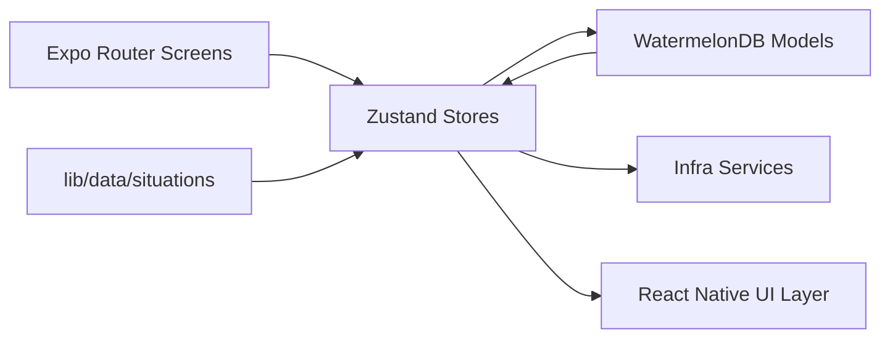

# Technical Handbook

This section collects the engineering notes you’ll want even as a solo dev: setup steps, architecture, scripts, and release hygiene.

## Environment

- Node 18+ (prefer 20 for docs build). Use `nvm` to swap if needed.
- Install Xcode CLT + iOS Simulator or Android Studio for native builds.
- `npm install` at repo root; Tailwind assets build during `postinstall`.
- Docs: `npm --prefix docs-site install` (first run) then `npm --prefix docs-site start`.

## Scripts Cheat Sheet

| Area | Command | Notes |
| --- | --- | --- |
| Dev servers | `npm run dev`, `npm run ios`, `npm run android`, `npm run web` | Expo Router with cache clear |
| Quality | `npm run lint`, `npm run typecheck`, `npm run format` | ESLint + TS + Prettier |
| Tests | `npm run test`, `npm run e2e` | Jest & Maestro smoke suites |
| Content | [`npm run gen-situation`](https://github.com/press-office/rn-ps/blob/main/scripts/run-gen-situation.ts) | CLI for authored scenarios |
| Builds | [`npm run build:dev:ios`](https://github.com/press-office/rn-ps/blob/main/eas.json), etc. | EAS profiles (dev/preview/prod) |
| Docs | `npm --prefix docs-site start` / `npm --prefix docs-site run build` | Local Docusaurus server & prod bundle |

## Architecture Snapshot

- **Expo Router** drives navigation under `app/`.
- **UI layer** uses React Native Reusables (shadcn-style) under `components/ui` + shared atoms.
- **State & data**
  - WatermelonDB models, schema, and migrations under `lib/db`.
  - Zustand stores + selectors under `lib/stores` and `lib/hooks`.
  - Static authored data in `lib/data/situations` validated with Zod schemas.
- **Infra** lives in `lib/infra` (Sentry, Amplitude, ads, diagnostics).
- **Scripts** under `scripts/` handle situation generation + utilities.

### Architecture Diagram

## Testing & Release

- Jest config: `jest-expo`, setup file `__tests__/support/jest-setup.ts`.
- Maestro smoke paths: `e2e/maestro/flows/*` with suites under `suites/`.
- Release sequencing: follow `TEARDOWN.md` for EAS builds, store metadata, privacy forms, and ATT/UMP verification.

## Docs Build & Deploy

- Preview locally: `npm --prefix docs-site start`.
- Production bundle: `npm --prefix docs-site run build`.
- Static preview: `npm --prefix docs-site run serve`.
- Deployment targets: GitHub Pages (via `npm --prefix docs-site run deploy`) or Vercel/Netlify by serving the `build/` output.

## Docs & Knowledge Base

- Overview + Showcase: `docs-site/docs/overview/*`.
- Gameplay: `docs-site/docs/gameplay/guide.md`.
- Technical sub-pages:
  - Content pipeline
  - Testing & QA
  - Infra & services
  - Compliance & privacy
  - Privacy disclosures matrix

