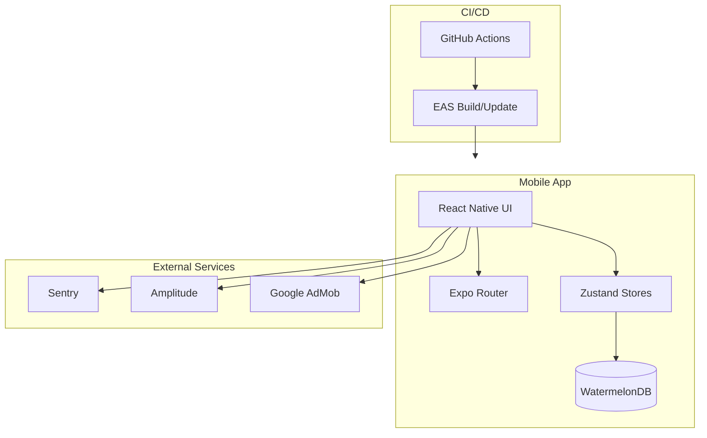
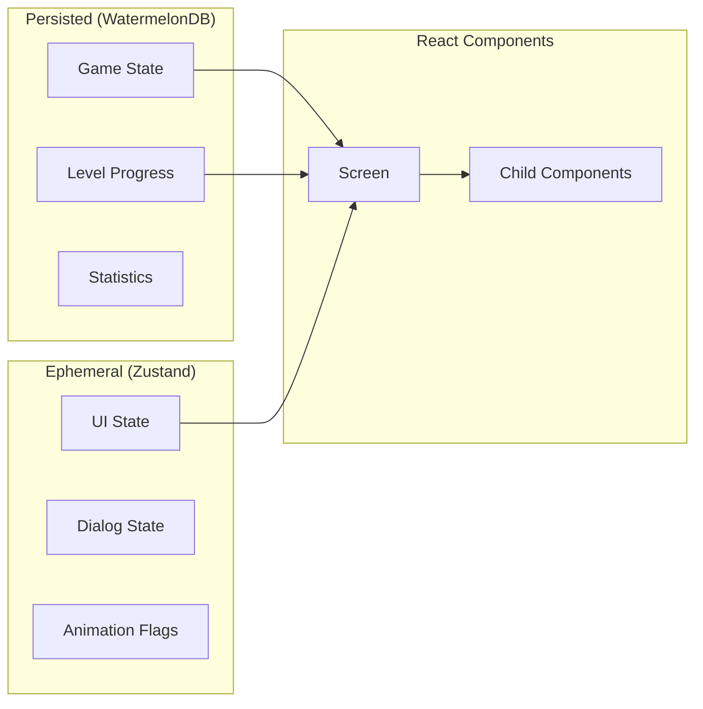

# Architecture Overview

Press Office is a React Native application built with Expo. It uses a "Local-First" architecture to ensure high performance and offline capability.

## System Architecture



### Text Diagram (Non-Mermaid)

```
┌─────────────────────────────────────────────────────────────────────────┐
│                         Press Office Architecture                        │
├─────────────────────────────────────────────────────────────────────────┤
│                                                                         │
│   ┌─────────────────────────────────────────────────────────────────┐   │
│   │                        Mobile App                                │   │
│   │                                                                  │   │
│   │   ┌──────────────┐    ┌──────────────┐    ┌──────────────┐      │   │
│   │   │  React Native│◄──▶│  Expo Router │◄──▶│   Zustand    │      │   │
│   │   │      UI      │    │  (Navigation)│    │   (State)    │      │   │
│   │   └──────┬───────┘    └──────────────┘    └──────┬───────┘      │   │
│   │          │                                       │               │   │
│   │          │            ┌──────────────┐           │               │   │
│   │          └───────────▶│ WatermelonDB │◄──────────┘               │   │
│   │                       │  (SQLite)    │                           │   │
│   │                       └──────────────┘                           │   │
│   └─────────────────────────────────────────────────────────────────┘   │
│                                    │                                     │
│                                    ▼                                     │
│   ┌─────────────────────────────────────────────────────────────────┐   │
│   │                      External Services                           │   │
│   │   ┌──────────┐    ┌──────────┐    ┌──────────┐                  │   │
│   │   │  Sentry  │    │ Amplitude│    │  AdMob   │                  │   │
│   │   │ (Errors) │    │(Analytics│    │  (Ads)   │                  │   │
│   │   └──────────┘    └──────────┘    └──────────┘                  │   │
│   └─────────────────────────────────────────────────────────────────┘   │
│                                                                         │
└─────────────────────────────────────────────────────────────────────────┘
```

## Tech Stack

| Category             | Technology                                                                          | Usage                              |
| -------------------- | ----------------------------------------------------------------------------------- | ---------------------------------- |
| **Framework**        | [Expo](https://expo.dev)                                                            | React Native build system & router |
| **Navigation**       | [Expo Router](https://docs.expo.dev/router/introduction/)                           | File-based routing                 |
| **UI / Styling**     | [NativeWind](https://www.nativewind.dev/)                                           | Tailwind CSS for React Native      |
| **State Management** | [Zustand](https://github.com/pmndrs/zustand)                                        | Global ephemeral state             |
| **Database**         | [WatermelonDB](https://watermelondb.dev/)                                           | Offline-first SQLite database      |
| **Components**       | [rn-primitives](https://rn-primitives.vercel.app/)                                  | Radix-style accessible primitives  |
| **Testing**          | [Maestro](https://maestro.mobile.dev/)                                              | E2E testing framework              |
| **CI/CD**            | [GitHub Actions](https://github.com/features/actions) + [EAS](https://expo.dev/eas) | Automation & builds                |

## Directory Structure

```
press-office/
├── app/                    # Expo Router screens
│   ├── _layout.tsx         # Root layout
│   ├── index.tsx           # Home screen
│   └── games/              # Game-related screens
│       └── [id]/           # Dynamic game routes
├── components/
│   ├── ui/                 # Primitive atoms (buttons, inputs)
│   ├── shared/             # Reusable domain components
│   └── screens/            # Screen-specific compositions
├── lib/
│   ├── db/                 # Database schema, models, helpers
│   ├── stores/             # Zustand stores
│   ├── hooks/              # Custom React hooks
│   ├── schemas/            # Zod validation schemas
│   └── data/               # Static content (situations)
├── e2e/
│   └── maestro/            # E2E test flows
├── scripts/                # Automation tools
└── docs-site/              # This documentation
```

## Data Flow



1. **Persisted Data**: Game state (current level, stats) is stored in **WatermelonDB**.
2. **Ephemeral Data**: UI state (current dialog open, animation flags) is stored in **Zustand**.
3. **Reactivity**: Components observe WatermelonDB objects using `withObservables` or interact with Zustand hooks.

## Documentation Sections

| Section                                   | Description                                  |
| ----------------------------------------- | -------------------------------------------- |
| [Database](./database.md)                 | WatermelonDB schema and models               |
| [Testing](./testing.md)                   | Unit tests and E2E testing with Maestro      |
| [CI/CD Pipeline](./ci-cd.md)              | GitHub Actions and EAS workflows             |
| [Infrastructure](./infra.md)              | Deployment, monitoring, and services         |
| [Content Pipeline](./content-pipeline.md) | Situation generation system                  |
| [Setup Guide](./setup-guide.md)           | External configuration (GitHub, EAS, stores) |
| [Roadmap](./roadmap.md)                   | Planned improvements and future work         |

## Key Design Decisions

### Local-First Architecture

All game data is stored locally in SQLite via WatermelonDB. This ensures:

- ✅ Instant load times
- ✅ Full offline capability
- ✅ No backend infrastructure needed
- ✅ User data stays on device (privacy)

### File-Based Routing

Expo Router provides automatic routing based on the `app/` directory structure:

- `app/index.tsx` → `/`
- `app/games/[id]/play.tsx` → `/games/123/play`

### Tailwind-Style Styling

NativeWind enables Tailwind CSS classes in React Native:

```tsx
<View className="flex-1 bg-background p-4">
  <Text className="text-xl font-bold text-foreground">Hello World</Text>
</View>
```
