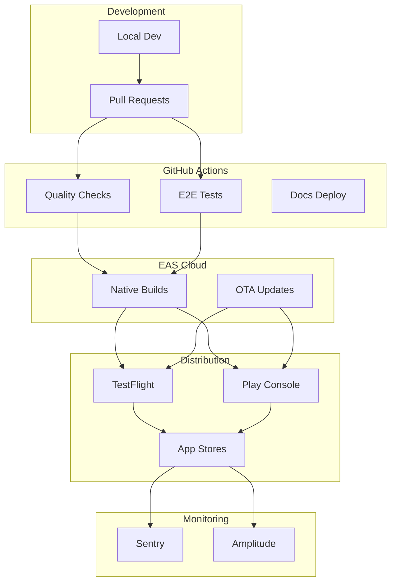

# Infrastructure

Our infrastructure is minimal and cloud-native, relying on **GitHub Actions** for automation and **Expo Application Services (EAS)** for builds and updates.

## Architecture Overview



### Text Diagram (Non-Mermaid)

```
┌─────────────────────────────────────────────────────────────────────────┐
│                          Infrastructure                                  │
├─────────────────────────────────────────────────────────────────────────┤
│                                                                         │
│   DEVELOPMENT           CI/CD                    DISTRIBUTION           │
│   ───────────           ─────                    ────────────           │
│                                                                         │
│   ┌──────────┐     ┌─────────────────┐     ┌─────────────────┐         │
│   │  Local   │────▶│  GitHub Actions │────▶│   EAS Cloud     │         │
│   │   Dev    │     │  • ci.yml       │     │   • Builds      │         │
│   └──────────┘     │  • e2e.yml      │     │   • Updates     │         │
│                    │  • eas-build    │     └────────┬────────┘         │
│   ┌──────────┐     │  • eas-update   │              │                  │
│   │   Pull   │────▶│  • docs-pages   │              ▼                  │
│   │ Requests │     └─────────────────┘     ┌─────────────────┐         │
│   └──────────┘                             │  Distribution   │         │
│                                            │  • TestFlight   │         │
│                                            │  • Play Console │         │
│                                            │  • App Stores   │         │
│                                            └────────┬────────┘         │
│                                                     │                  │
│                           MONITORING                ▼                  │
│                           ──────────     ┌─────────────────┐           │
│                                          │    Sentry       │           │
│                                          │    Amplitude    │           │
│                                          └─────────────────┘           │
│                                                                         │
└─────────────────────────────────────────────────────────────────────────┘
```

## GitHub Actions Workflows

Defined in `.github/workflows/`. See [CI/CD Pipeline](./ci-cd.md) for full details.

| Workflow         | Triggers                     | Purpose                                        |
| ---------------- | ---------------------------- | ---------------------------------------------- |
| `ci.yml`         | PRs, push to main/release    | Quality checks: lint, typecheck, tests, format |
| `e2e.yml`        | PRs, push to main/release    | E2E tests via Maestro on iOS & Android         |
| `eas-build.yml`  | Push to main/release, manual | Native builds via EAS                          |
| `eas-update.yml` | Push to main (JS changes)    | OTA updates to preview channel                 |
| `docs-pages.yml` | Push to main                 | Build & deploy documentation                   |

## Expo Application Services (EAS)

### Build Profiles

| Profile       | Channel       | Use Case                       |
| ------------- | ------------- | ------------------------------ |
| `development` | `development` | Local dev with dev client      |
| `preview`     | `preview`     | Internal testing / TestFlight  |
| `production`  | `production`  | App Store / Play Store         |
| `test`        | `test`        | E2E testing (simulator builds) |

### Build Commands

```bash
# Development build (dev client)
eas build --profile development --platform ios

# Preview build (TestFlight/Internal)
eas build --profile preview --platform all

# Production build (Store submission)
eas build --profile production --platform all

# Test build (for E2E)
eas build --profile test --platform ios
```

### OTA Updates

JavaScript-only changes can be deployed instantly:

```bash
# Push update to preview channel
eas update --channel preview --message "Bug fix for issue #123"

# Push to production (careful!)
eas update --channel production --message "Hotfix v1.0.1"
```

### Runtime Version Policy

The `runtimeVersion` tells EAS Update which OTA updates are compatible with which native builds. We use the **`appVersion`** policy, configured in `app.config.ts`:

```typescript
// app.config.ts
export default ({ config }: ConfigContext): ExpoConfig => ({
  // ...
  runtimeVersion: {
    policy: 'appVersion',
  },
  // ...
});
```

**Policy Options:**

| Policy          | How it Works                                    | Trade-offs                                                     |
| --------------- | ----------------------------------------------- | -------------------------------------------------------------- |
| `appVersion`    | Uses `version` from app.json (e.g., "1.0.0")    | Simple, human-readable. Manual version bump on native changes. |
| `nativeVersion` | Uses version + build number (e.g., "1.0.0(42)") | Auto-increments. Harder to reason about.                       |
| `fingerprint`   | Auto-generates hash from native code            | Fully automatic, safest. Less predictable version strings.     |

**Why `appVersion`:**

- Simple and human-readable in crash reports
- You control when versions change
- Matches standard app versioning practices

**Update Workflow:**

| Change Type                 | Action                            | Version Bump? |
| --------------------------- | --------------------------------- | ------------- |
| JS-only (bug fix, UI tweak) | `eas update --channel production` | ❌ No         |
| New native dependency       | Build + submit to stores          | ✅ Yes        |
| SDK/Expo upgrade            | Build + submit to stores          | ✅ Yes        |
| New native module           | Build + submit to stores          | ✅ Yes        |

**Rollback Plan:**

1. **Bad OTA update** → Publish revert update to same channel
2. **Bad native build** → Submit new store build
3. **Channel promotion** → Test on `preview` before promoting to `production`

## Monitoring

### Sentry (Error Tracking)

- **SDK**: `@sentry/react-native`
- **Features**: Crash reporting, performance monitoring, release tracking
- **Environment tags**: Set via `APP_ENV` in EAS build profiles

```typescript
// Automatic error capture
Sentry.init({
  dsn: process.env.SENTRY_DSN,
  environment: process.env.APP_ENV,
});
```

### Amplitude (Analytics)

- **SDK**: `@amplitude/analytics-react-native`
- **Events**: Session tracking, level completion, ad engagement
- **Data residency**: US (`api2.amplitude.com`) or EU (`api.eu.amplitude.com`)

## Environment Variables

### EAS Secrets

Configure via `eas env:create` or EAS Dashboard:

| Variable               | Used For           |
| ---------------------- | ------------------ |
| `SENTRY_DSN`           | Error reporting    |
| `ANALYTICS_API_KEY`    | Amplitude tracking |
| `ADMOB_ANDROID_APP_ID` | Android ads        |
| `ADMOB_IOS_APP_ID`     | iOS ads            |

### GitHub Secrets

Configure in **Settings → Secrets → Actions**:

| Secret            | Used For           |
| ----------------- | ------------------ |
| `EXPO_TOKEN`      | EAS authentication |
| `PUBLIC_DOCS_PAT` | Docs deployment    |

## Publishing Checklist

Before submitting a new release:

### 1. AdMob & Consent

- [ ] Configure UMP messages for EEA/UK (TCF 2.2) + US states (GPP)
- [ ] Verify test ads work in preview builds
- [ ] Switch to production AdMob IDs for release

### 2. Environment Variables

- [ ] Set EAS secrets for the target profile
- [ ] Verify Sentry DSN is correct
- [ ] Confirm Amplitude host matches data residency

### 3. Store Listings

- [ ] Update Privacy Policy + Terms URLs
- [ ] Complete App Store "App Privacy" survey
- [ ] Complete Play "Data Safety" form
- [ ] Verify COPPA status (not child-directed)

### 4. Compliance

- [ ] Test ATT flow on iOS
- [ ] Verify consent dialog appears correctly
- [ ] Cross-check `docs-site/docs/compliance/privacy.md`

### 5. Build & Submit

```bash
# Build for production
eas build --profile production --platform all

# Submit to stores
eas submit --platform ios
eas submit --platform android
```

## Cost Considerations

| Service            | Free Tier                | Paid                |
| ------------------ | ------------------------ | ------------------- |
| **GitHub Actions** | 2,000 min/month          | $0.008/min (Linux)  |
| **EAS Build**      | 15 builds/platform/month | $19/month (Starter) |
| **EAS Update**     | Unlimited                | Included            |
| **Sentry**         | 5K errors/month          | Usage-based         |
| **Amplitude**      | 10M events/month         | Usage-based         |
