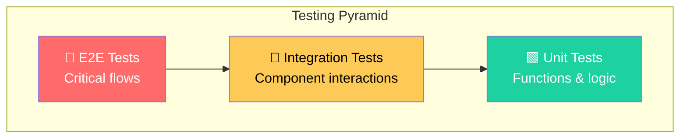
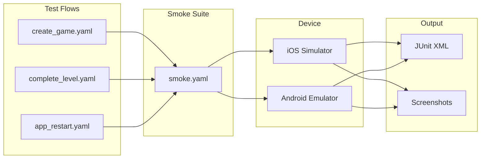
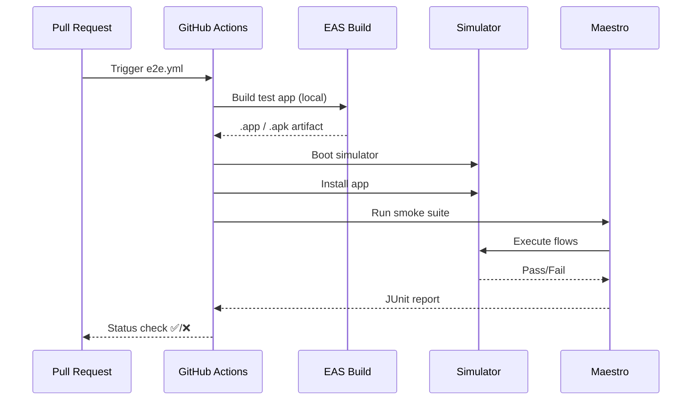

# Testing Strategy

We use a comprehensive testing approach combining unit tests for logic and end-to-end (E2E) tests for critical user flows.

## Testing Pyramid



### Text Diagram (Non-Mermaid)

```
                    ▲
                   ╱ ╲
                  ╱   ╲
                 ╱ E2E ╲         Few, Slow, High Confidence
                ╱───────╲
               ╱         ╲
              ╱Integration╲     Some, Medium Speed
             ╱─────────────╲
            ╱               ╲
           ╱   Unit Tests    ╲   Many, Fast, Focused
          ╱───────────────────╲
         ▔▔▔▔▔▔▔▔▔▔▔▔▔▔▔▔▔▔▔▔▔▔▔
```

## Unit Tests

**Framework**: Jest + React Native Testing Library  
**Location**: `__tests__/`

### What We Test

| Category       | Location                | Examples                             |
| -------------- | ----------------------- | ------------------------------------ |
| **Utilities**  | `__tests__/lib/`        | `utils.test.ts` - helper functions   |
| **Components** | `__tests__/components/` | Snapshot & interaction tests         |
| **Database**   | `__tests__/lib/db/`     | Model logic with mocked WatermelonDB |
| **Hooks**      | `__tests__/lib/hooks/`  | Custom React hooks                   |

### Running Unit Tests

```bash
# Watch mode (development)
npm test

# Single run (CI)
npm run test:ci

# With coverage
npm test -- --coverage
```

### Test Structure

```typescript
// __tests__/lib/utils.test.ts
import { formatScore, calculateRisk } from '@/lib/utils';

describe('formatScore', () => {
  it('formats positive scores with plus sign', () => {
    expect(formatScore(10)).toBe('+10');
  });

  it('formats negative scores correctly', () => {
    expect(formatScore(-5)).toBe('-5');
  });
});
```

### Mocking WatermelonDB

We use a custom test database setup:

```typescript
// __tests__/support/db.ts
import { Database } from '@nozbe/watermelondb';
import SQLiteAdapter from '@nozbe/watermelondb/adapters/sqlite';

export const createTestDatabase = () => {
  const adapter = new SQLiteAdapter({
    schema,
    jsi: false,
    onSetUpError: (error) => console.error(error),
  });
  return new Database({ adapter, modelClasses });
};
```

---

## End-to-End (E2E) Tests

**Framework**: [Maestro](https://maestro.mobile.dev/)  
**Location**: `e2e/maestro/`

Maestro provides a simple YAML-based syntax for defining user flows. Tests run against real simulators/emulators.

### E2E Architecture



### Text Diagram (Non-Mermaid)

```
e2e/maestro/
├── flows/
│   ├── games/
│   │   └── create_game.yaml     # Create new game flow
│   ├── levels/
│   │   └── complete_level.yaml  # Full level playthrough
│   ├── app/
│   │   └── app_restart.yaml     # Persistence test
│   └── ads/
│       └── rewarded_ad.yaml     # Ad flow (draft)
└── suites/
    └── smoke.yaml               # Main test suite

                    ▼
    ┌───────────────────────────────┐
    │         Maestro CLI           │
    │  • Launches app               │
    │  • Executes YAML steps        │
    │  • Captures screenshots       │
    │  • Generates reports          │
    └───────────────────────────────┘
                    ▼
    ┌───────────────┬───────────────┐
    │ iOS Simulator │ Android Emu   │
    └───────────────┴───────────────┘
```

### Test Suites

| Suite        | Purpose            | Flows Included |
| ------------ | ------------------ | -------------- |
| `smoke.yaml` | Quick sanity check | create_game    |

### Test Flows

| Flow                  | Description                                        | Critical Path |
| --------------------- | -------------------------------------------------- | ------------- |
| `create_game.yaml`    | Create new game with custom president/secretary    | ✅            |
| `complete_level.yaml` | Full level: briefing → press conference → outcomes | ✅            |
| `app_restart.yaml`    | Verify data persists after app restart             | ✅            |
| `rewarded_ad.yaml`    | Watch ad and receive reward                        | ⚠️ (draft)    |

### Flow Anatomy

```yaml
# e2e/maestro/flows/games/create_game.yaml
appId: com.phetzel.rnps
name: Create Game
tags:
  - smoke
  - critical
onFlowStart:
  - clearState
  - launchApp
---
# Dismiss disclaimer if present
- tapOn:
    text: 'I understand'
    optional: true

# Wait for home screen
- assertVisible:
    text: 'Start New Game'
    timeout: 10000

# Start game creation
- tapOn: 'Start New Game'
- assertVisible: 'New Press Secretary Career'

# Fill form
- tapOn: 'George Washington...'
- inputText: 'John Adams'
- tapOn: 'Liberal'
- tapOn: 'George Akerson...'
- inputText: 'James Brady'
- tapOn: 'Select background'
- tapOn: 'Journalist'

# Submit
- tapOn: 'Create Game'

# Verify success
- assertVisible:
    text: 'Active Situations'
    timeout: 10000
```

### Running E2E Tests

#### Prerequisites

```bash
# 1. Install Java 17 (required for Maestro)
brew install openjdk@17
echo 'export PATH="/opt/homebrew/opt/openjdk@17/bin:$PATH"' >> ~/.zshrc
echo 'export JAVA_HOME="/opt/homebrew/opt/openjdk@17"' >> ~/.zshrc
source ~/.zshrc

# 2. Install Maestro CLI
curl -Ls "https://get.maestro.mobile.dev" | zsh
export PATH="$HOME/.maestro/bin:$PATH"

# 3. Verify installation
maestro --version
```

#### Run Tests

```bash
# Run full smoke suite
npm run e2e

# Platform-specific
npm run e2e:ios
npm run e2e:android

# Run single flow
npm run e2e:flow e2e/maestro/flows/games/create_game.yaml

# Interactive test builder (great for debugging)
npm run e2e:studio
```

### Maestro Studio

Maestro Studio provides an interactive UI for building and debugging tests:

```bash
npm run e2e:studio
```

Features:

- **Live device view** - See exactly what Maestro sees
- **Element inspector** - Find selectors for UI elements
- **Step-by-step execution** - Debug flow step by step
- **YAML generation** - Auto-generate flow files

### CI Integration

E2E tests run automatically in CI via `e2e.yml`:



### Debugging Failed Tests

1. **Check JUnit report**: Download from GitHub Actions artifacts
2. **View screenshots**: Uploaded on test failure
3. **Run locally**: Reproduce with `npm run e2e:studio`
4. **Check timeouts**: Increase `timeout` values for slow animations

### Best Practices

| Practice                                     | Why                         |
| -------------------------------------------- | --------------------------- |
| Use `optional: true` for dismissible dialogs | Prevents flaky failures     |
| Add `timeout` to `assertVisible`             | Handles loading states      |
| Use `onFlowStart: clearState`                | Ensures clean test state    |
| Tag flows with `smoke`, `critical`           | Enable selective runs       |
| Keep flows focused                           | One flow = one user journey |

---

## Test Coverage Goals

| Layer      | Target                  | Current |
| ---------- | ----------------------- | ------- |
| Unit Tests | 60% of `lib/` functions | Growing |
| E2E Tests  | Critical user paths     | 4 flows |

## Continuous Integration

All tests run automatically:

- **Unit tests**: Every PR and push to main
- **E2E tests**: Every PR and push to main
- **Bundle analysis**: Every PR (comment on size changes)

See [CI/CD Pipeline](./ci-cd.md) for full details.
