# Testing Strategy

We use a comprehensive testing approach combining unit tests for logic and end-to-end (E2E) tests for critical user flows.

## Testing Pyramid

```mermaid
graph TB
    subgraph pyramid["Testing Pyramid"]
        E2E["🔺 E2E Tests<br/>Critical flows"]
        Int["🔶 Integration Tests<br/>Component interactions"]
        Unit["🟩 Unit Tests<br/>Functions & logic"]
    end

    E2E --> Int
    Int --> Unit

    style E2E fill:#ff6b6b,color:#fff
    style Int fill:#feca57,color:#000
    style Unit fill:#1dd1a1,color:#fff
```



### Text Diagram (Non-Mermaid)

```
                    ▲
                   ╱ ╲
                  ╱   ╲
                 ╱ E2E ╲         Few, Slow, High Confidence
                ╱───────╲
               ╱         ╲
              ╱Integration╲     Some, Medium Speed
             ╱─────────────╲
            ╱               ╲
           ╱   Unit Tests    ╲   Many, Fast, Focused
          ╱───────────────────╲
         ▔▔▔▔▔▔▔▔▔▔▔▔▔▔▔▔▔▔▔▔▔▔▔
```

## Unit Tests

**Framework**: Jest + React Native Testing Library  
**Location**: `__tests__/`

### What We Test

| Category       | Location                | Examples                             |
| -------------- | ----------------------- | ------------------------------------ |
| **Utilities**  | `__tests__/lib/`        | `utils.test.ts` - helper functions   |
| **Components** | `__tests__/components/` | Snapshot & interaction tests         |
| **Database**   | `__tests__/lib/db/`     | Model logic with mocked WatermelonDB |
| **Hooks**      | `__tests__/lib/hooks/`  | Custom React hooks                   |

### Running Unit Tests

```bash
# Run tests (single run)
npm test

# CI mode (exits with status code)
npm run test:ci

# Watch mode (re-runs on file changes)
npm test -- --watch

# With coverage
npm test -- --coverage
```

### Test Structure

```typescript
// __tests__/lib/utils.test.ts
import { formatScore, calculateRisk } from '@/lib/utils';

describe('formatScore', () => {
  it('formats positive scores with plus sign', () => {
    expect(formatScore(10)).toBe('+10');
  });

  it('formats negative scores correctly', () => {
    expect(formatScore(-5)).toBe('-5');
  });
});
```

### Mocking WatermelonDB

We use a custom test database setup:

```typescript
// __tests__/support/db.ts
import { Database } from '@nozbe/watermelondb';
import SQLiteAdapter from '@nozbe/watermelondb/adapters/sqlite';

export const createTestDatabase = () => {
  const adapter = new SQLiteAdapter({
    schema,
    jsi: false,
    onSetUpError: (error) => console.error(error),
  });
  return new Database({ adapter, modelClasses });
};
```

---

## End-to-End (E2E) Tests

**Framework**: [Maestro](https://maestro.mobile.dev/)  
**Location**: `e2e/maestro/`

Maestro provides a simple YAML-based syntax for defining user flows. Tests run against real simulators/emulators.

### E2E Architecture


### Text Diagram (Non-Mermaid)

```
e2e/maestro/
├── flows/                        # Main test flows (flat structure)
│   ├── create_game.yaml          # Create new game flow
│   ├── complete_level.yaml       # Level playthrough
│   ├── app_restart.yaml          # Persistence test
│   └── rewarded_ad.yaml          # Ad flow (flaky)
├── shared/                       # Reusable subflows
│   ├── connect_dev_server.yaml   # Dev client connection
│   ├── setup_game.yaml           # Create game (reusable)
│   └── cleanup_games.yaml        # Delete all games
└── suites/
    └── smoke.yaml                # Main test suite

                    ▼
    ┌───────────────────────────────┐
    │         Maestro CLI           │
    │  • Launches app               │
    │  • Executes YAML steps        │
    │  • Captures screenshots       │
    │  • Generates reports          │
    └───────────────────────────────┘
                    ▼
    ┌───────────────┬───────────────┐
    │ iOS Simulator │ Android Emu   │
    └───────────────┴───────────────┘
```

### Test Flows

| Flow                  | Description                                     | Status |
| --------------------- | ----------------------------------------------- | ------ |
| `create_game.yaml`    | Clean up + create new game                      | ✅     |
| `complete_level.yaml` | Create game + navigate through briefing         | ✅     |
| `app_restart.yaml`    | Create game + verify persistence after restart  | ✅     |
| `rewarded_ad.yaml`    | Create game + test ad flow                      | ⚠️     |

### Shared Flows

| Flow                      | Purpose                              |
| ------------------------- | ------------------------------------ |
| `connect_dev_server.yaml` | Handle Expo dev client connection    |
| `setup_game.yaml`         | Reusable game creation steps         |
| `cleanup_games.yaml`      | Delete all existing games            |

### Flow Anatomy

```yaml
# e2e/maestro/flows/create_game.yaml
appId: com.phetzel.rnps
name: Create Game
tags:
  - smoke
  - critical
onFlowStart:
  - launchApp  # Don't use clearState with dev client
---
# Connect to dev server (for Expo dev client builds)
- runFlow: ../shared/connect_dev_server.yaml

# Wait for app to load
- extendedWaitUntil:
    visible: '.*'
    timeout: 30000

# Dismiss disclaimer if present
- tapOn:
    id: 'disclaimer-acknowledge-button'
    optional: true

# Clean up existing games (ensures clean state)
- runFlow: ../shared/cleanup_games.yaml

# Create a new game using shared flow
- runFlow: ../shared/setup_game.yaml

# Test passes if we reach the game screen
```

### Shared Flow Example

```yaml
# e2e/maestro/shared/setup_game.yaml
appId: com.phetzel.rnps
---
# Wait for Start New Game button
- extendedWaitUntil:
    visible:
        id: 'start-new-game-button'
    timeout: 10000

# Start game creation
- tapOn:
    id: 'start-new-game-button'

# Fill form using testIDs (more reliable than text)
- tapOn:
    id: 'president-name-input'
- inputText: 'Test President'
- hideKeyboard

- tapOn: 'Conservative'

- tapOn:
    id: 'press-secretary-name-input'
- inputText: 'Test Secretary'
- hideKeyboard

# Select background (use point for Portal elements)
- tapOn:
    id: 'background-select-trigger'
- tapOn:
    point: '50%,58%'  # Journalist option

# Create the game
- tapOn:
    id: 'create-game-button'

# Verify success
- extendedWaitUntil:
    visible:
        id: 'active-situations-header'
    timeout: 15000
```

### Running E2E Tests

#### Prerequisites

```bash
# 1. Install Java 17 (required for Maestro)
brew install openjdk@17
echo 'export PATH="/opt/homebrew/opt/openjdk@17/bin:$PATH"' >> ~/.zshrc
echo 'export JAVA_HOME="/opt/homebrew/opt/openjdk@17"' >> ~/.zshrc
source ~/.zshrc

# 2. Install Maestro CLI
curl -Ls "https://get.maestro.mobile.dev" | zsh
export PATH="$HOME/.maestro/bin:$PATH"

# 3. Verify installation
maestro --version
```

#### Run Tests

```bash
# Run full smoke suite
npm run e2e

# Platform-specific
npm run e2e:ios
npm run e2e:android

# Run single flow
npm run e2e:flow e2e/maestro/flows/games/create_game.yaml

# Interactive test builder (great for debugging)
npm run e2e:studio
```

### Maestro Studio

Maestro Studio provides an interactive UI for building and debugging tests:

```bash
npm run e2e:studio
```

Features:

- **Live device view** - See exactly what Maestro sees
- **Element inspector** - Find selectors for UI elements
- **Step-by-step execution** - Debug flow step by step
- **YAML generation** - Auto-generate flow files

### CI Integration

E2E tests run automatically in CI via `e2e.yml`:

```mermaid
sequenceDiagram
    participant PR as Pull Request
    participant CI as GitHub Actions
    participant EAS as EAS Build
    participant Sim as Simulator
    participant M as Maestro

    PR->>CI: Trigger e2e.yml
    CI->>EAS: Build test app (local)
    EAS-->>CI: .app / .apk artifact
    CI->>Sim: Boot simulator
    CI->>Sim: Install app
    CI->>M: Run smoke suite
    M->>Sim: Execute flows
    Sim-->>M: Pass/Fail
    M-->>CI: JUnit report
    CI-->>PR: Status check ✅/❌
```



### Debugging Failed Tests

1. **Check JUnit report**: Download from GitHub Actions artifacts
2. **View screenshots**: Uploaded on test failure
3. **Run locally**: Reproduce with `npm run e2e:studio`
4. **Check timeouts**: Increase `timeout` values for slow animations

### Best Practices

| Practice                                     | Why                                        |
| -------------------------------------------- | ------------------------------------------ |
| Use `testID` selectors over text             | More reliable, survives text changes       |
| Use shared flows for reusable operations     | DRY, easier maintenance                    |
| Clean up at START of tests, not end          | Ensures clean state regardless of failures |
| Use `optional: true` for dismissible dialogs | Prevents flaky failures                    |
| Add `timeout` to `extendedWaitUntil`         | Handles loading states                     |
| Use `point` for Portal elements              | Maestro can't access iOS Portals by ID     |
| Don't use `clearState` with dev client       | Causes issues with Expo dev builds         |
| Tag flows with `smoke`, `critical`           | Enable selective runs                      |
| Keep flows focused                           | One flow = one user journey                |

---

## Test Coverage Goals

| Layer      | Target                  | Current |
| ---------- | ----------------------- | ------- |
| Unit Tests | 60% of `lib/` functions | Growing |
| E2E Tests  | Critical user paths     | 4 flows |

## Continuous Integration

All tests run automatically:

- **Unit tests**: Every PR and push to main
- **E2E tests**: Every PR and push to main
- **Bundle analysis**: Every PR (comment on size changes)

See [CI/CD Pipeline](./ci-cd.md) for full details.
